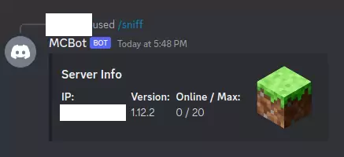
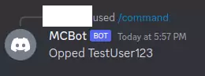
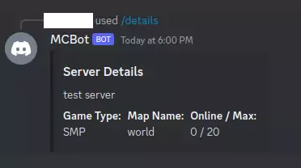
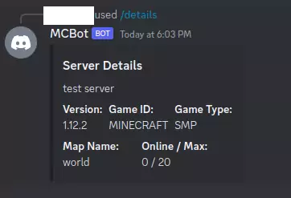

# mcstats

A simple, lightweight (~1.5MB start, ~3.5MB idle memory usage) self-hosted Discord Slash Command Bot to see a self-hosted minecraft server's stats. It is especially helpful to use `/sniff` if you don't have static ip at home or your server.

## Features
1. Simple data and ip finding with `/sniff`:
    
    

2. Remote command execution with `/command`:
    * Requires `enable-rcon=true` in `server.properties` 

    

3. Simple info about server with `/details Simple`:
    * Requires `enable-query=true` in `server.properties` 

    

4. Detailed info about server with `/details Detailed`:
    * Requires `enable-query=true` in `server.properties` 

    

## How To Use?
1. Install rust compiler and cargo from [here](https://www.rust-lang.org/learn/get-started).
2. Clone the repository.
3. Edit [`sample.env`](./sample.env) and rename it to `.env`.
4. Open the terminal and run the bot with `cargo run --release`.